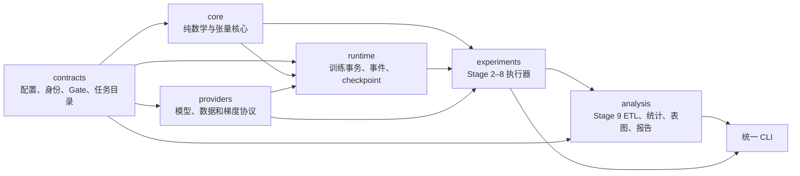

# 参数重要性实验系统

`param-importance-nlp` 是一套用于研究 NLP 模型参数重要性的可恢复实验系统。它把训练、在线重要性估计、固定状态估计器比较、更新路径积分、训练路线、剪枝、消融、统计和报告组织为同一条可审计证据链。

当前代码版本为 **0.4.0**。这里的 “Stage 0–9” 表示任务合同和执行代码的覆盖范围，不表示服务器实验已经完成，也不表示任何科学结论已经通过正式 Gate。

## 项目能做什么

系统主要回答两类问题：

1. 在固定参数状态下，怎样用 raw、独立 double sample 或 U-statistic 估计每个参数的局部梯度空间重要性？
2. 在一次真实参数更新中，各参数沿更新路径对端点损失变化贡献了多少？

围绕这两个对象，仓库提供：

- 可直接执行的 tiny causal-LM 与分类训练，用于本机回归和完整生命周期验证；
- 在真实训练 step 中计算 raw、double、U 及 clipped plug-in 在线分数；
- optimizer、scheduler、scaler、RNG、数据游标、事件和重要性累计器的完整 checkpoint；
- Stage 2 固定状态 reference、paired wave、pilot 与 estimator decision；
- Stage 3 endpoint/probe、节点缓存、路径积分 reference 与 quadrature recommendation；
- Stage 4–6 pretrain、direct supervised、finetune 路线 DAG；
- Stage 7 剪枝、Stage 8 消融、Stage 9 跨阶段 ETL、统计、表图和报告；
- 统一的任务目录、CLI、恢复、重放、审核和 Gate 产物。

后续正式运行允许填写并提交版本化配置、资产 manifest 和人工审核决定。若真实环境暴露普通缺陷，可以修复并回归；若仍需临时补写某个计划内 runner、实验脚本或分析 notebook，则说明 `feature-code-complete` 验收遗漏。

## 必须先理解的状态边界

正式 Gate 与本机验证互不替代：

| 记录 | 状态 | 含义 |
|---|---|---|
| `GateRecord` | `PASS / CONDITIONALLY_ACCEPTED / FAIL / BLOCKED / STALE / NOT_RUN` | 正式资产、环境、阈值和科学决策是否具备资格 |
| `LocalValidationRecord` | `PASS / FAIL / SKIPPED / NOT_RUN` | 本机代码或 fixture 是否按合同工作 |

`BLOCKED` 通常表示服务器、GPU、依赖、资产、前置 Gate 或审核决定尚不可用；它不是代码测试失败。`UNFROZEN` 表示必须由真实 pilot 决定的 B/M/R、reference 规模、probe 数、节点预算或阈值尚未冻结；它也不是 `FAIL`。

本机 fixture 固定为 `run_intent=local_fixture`、`scope=local_fixture`、`formal_eligible=false`。即使所有本机测试通过，也不能把服务器、CUDA/NCCL、真实资产或 formal Gate 改成 `PASS`。

当前约束是只在 Windows 本机开发和验证：不连接服务器、不执行 SSH 或管理员脚本、不下载模型和数据，也不安装可选 Hugging Face/CUDA 依赖。正式命令缺少这些条件时应产生结构化 `BLOCKED`，不得静默降级成 synthetic formal 结果。

## 架构与依赖方向



- `contracts` 是 fail-closed 的可信边界，不依赖训练和分析实现。
- `core` 保存可单独验证的数学与张量运算，不访问网络或模型供应商。
- `runtime` 管理有状态训练、事务提交和故障恢复。
- `providers` 把 tiny fixture、离线 Hugging Face 资产和固定状态梯度接入统一协议。
- `experiments` 只消费已验证合同和上游产物，编排 Stage 2–8。
- `analysis` 只从带哈希的冻结源表派生数值、表、图和报告。

## 仓库结构

```text
.
├─ src/param_importance_nlp/
│  ├─ contracts/       ResolvedConfig v1/v2、任务目录、身份、seed、审核和 Gate
│  ├─ core/            registry、loss、估计器、累计器、求积、剪枝和指标
│  ├─ runtime/         训练引擎、DDP、事件、checkpoint、TaskRuntime 和生命周期
│  ├─ providers/       tiny、Torch、离线 Hugging Face、固定状态和 synthetic provider
│  ├─ experiments/     Stage 2–8 正式/fixture runner、路线、剪枝和消融
│  ├─ analysis/        跨阶段 ETL、统计、表、图、报告和派生索引
│  ├─ cli.py           `param-importance` 统一命令入口
│  └─ local_fixture.py 兼容的 Stage 0–9 缩小版数学流水线
├─ configs/
│  ├─ local-fixtures/  v1 本机合同 fixture
│  └─ run-ready/       v2 执行配置层和 task override 示例
├─ schemas/            canonical artifact 与配置 JSON Schema
├─ docs/               数学规格、工程决策和运行手册
├─ plan/               Stage 0–9 任务计划
├─ environment/        本机/服务器依赖锁和 wheel 清单
├─ ops/                静态合同工具及受控运维脚本
├─ tests/              单元、性质、恢复、DDP 和端到端测试
├─ reports/            可提交的小型验证证据
├─ worklogs/           中文实施与验证日志
└─ legacy/             冻结历史归档，不参与当前 formal 证据链
```

模型、数据、checkpoint、cache、wheel、大型数组和原始运行目录不进入 Git。

## 训练与在线重要性代码在哪里

训练不是只停留在路线合同中。关键实现位置如下：

| 文件 | 作用 |
|---|---|
| `src/param_importance_nlp/runtime/training.py` | `TrainingEngine`：microbatch、forward/loss/backward、全局统计、finite/skip、clip、optimizer step、重要性事务、scheduler 和 checkpoint |
| `src/param_importance_nlp/runtime/distributed_training.py` | 本机/torchrun DDP executor、rank 协调和安全 teardown |
| `src/param_importance_nlp/runtime/training_factory.py` | 只构造合同允许的 optimizer、scheduler 和 scaler |
| `src/param_importance_nlp/core/estimators.py` | raw、double、U、weighted U、cross-U 数学核心 |
| `src/param_importance_nlp/core/accumulator.py` | signed/positive/negative/absolute、data/weight-decay movement 和端点位移累计 |
| `src/param_importance_nlp/experiments/training_routes.py` | 可恢复的 phase DAG 与 phase commit |
| `src/param_importance_nlp/experiments/training_endpoints.py` | 自动捕获 pre、parameter-post、attempt-commit endpoint |
| `src/param_importance_nlp/experiments/stage456_task_runners.py` | Stage 4–6 route task 到真实训练引擎的适配 |
| `src/param_importance_nlp/providers/training.py` | 模型、数据游标、microbatch 和 evaluator 协议/实现 |
| `src/param_importance_nlp/providers/tiny.py` | 无下载的 tiny causal-LM / classifier fixture |
| `src/param_importance_nlp/providers/huggingface_offline.py` | 严格本地 Pile/GLUE 数据和任务指标适配，不允许联网 |

训练 step 的核心顺序是：

```text
deterministic batch/microbatch
  -> forward + loss numerator/denominator
  -> backward + sufficient statistics reduction
  -> unscale -> global finite/skip -> global clip
  -> raw/double/U 或 clipped plug-in staging
  -> optimizer step -> parameter_post_state
  -> importance accumulator transaction
  -> scheduler/scaler/RNG -> attempt_commit_state
  -> event/checkpoint/trajectory publish
```

开启或关闭重要性观察不得改变模型参数、随机数消费或 optimizer 更新。未裁剪 U 核心只在记录的固定状态与抽样假设下声明无偏；同批随机裁剪产生的分数标为 plug-in，不声称严格无偏。

## 数学与存储合同

- causal-LM loss 使用 shift 后的有效 token；分类 loss 使用有效 sample。loss 的 numerator、denominator 和统计单位都进入合同。
- 学习率是参数组映射 `eta[g(k), t]`，动态学习率不进入坐标 registry hash。
- 参数分别绑定 `coordinate_registry_hash`、`optimizer_contract_hash` 和 `runtime_layout_hash`。
- 在线梯度、S1/S2 和长期累计使用 FP32，计数为 int64；oracle/reference 使用 FP64；比较前统一转 FP64。
- `signed = positive - negative_mass`，`absolute = positive + negative_mass`。
- canonical JSON 必须是 UTF-8、无 BOM、无重复键、无非有限数；legacy BOM 文件只能经 importer 规范化后重新发布。
- tensor/checkpoint 使用 JSON manifest 加逐张量二进制文件，记录 dtype、shape、字节序、大小和 SHA-256，不加载任意 pickle。
- checkpoint 采用“不可变对象发布 + 独立权威 commit”两阶段协议；目录 rename 本身不代表可恢复。

完整公式和假设见[数学规格](docs/mathematics.md)。

## 环境准备

本机基准环境是 Windows、CPython 3.12、Torch 2.10 CPU。仓库不保存 wheel，也不会自动下载依赖。

```powershell
py -3.12 -m venv .venv

# <wheelhouse> 必须先按 environment/windows-cpu-wheel-manifest.tsv 验收。
.\.venv\Scripts\python.exe -m pip install `
  --no-index --find-links <wheelhouse> --require-hashes `
  -r environment\windows-cpu-requirements-hashed.lock

.\.venv\Scripts\python.exe -m pip install --no-build-isolation --no-deps -e .
$PY = ".\.venv\Scripts\python.exe"
```

没有 editable install 时，也可以临时设置 `$env:PYTHONPATH='src'` 后使用 `python -m param_importance_nlp`。正式运行应使用已哈希绑定的环境证据。

## 从空输出目录运行 tiny fixture

以下流程不访问网络，不需要模型或数据。配置允许版本化填写；示例先把 v1 科学合同和 v2 执行字段解析为完整 `ResolvedConfig v2`。

```powershell
$PY = ".\.venv\Scripts\python.exe"
$OUT = "artifacts\run-ready\readme-tiny"
New-Item -ItemType Directory -Force $OUT | Out-Null

& $PY -m param_importance_nlp config-resolve-v2 `
  configs\local-fixtures\resolved-config-v1.json `
  configs\run-ready\layers\local-classification-stage0.yaml `
  --task-id stage0.06_single_gpu_smoke `
  --overrides configs\run-ready\v2\stage0-training-smoke.yaml `
  --output "$OUT\resolved-config-v2.json"

# 空环境也是 hash-bound artifact；它不会声明服务器、GPU、Gate 或正式合同。
& $PY -m param_importance_nlp task environment-build `
  --output "$OUT\runtime-environment.json"

& $PY -m param_importance_nlp task preflight `
  --config "$OUT\resolved-config-v2.json" `
  --environment "$OUT\runtime-environment.json" `
  --output "$OUT\preflight.json"

& $PY -m param_importance_nlp task run `
  --config "$OUT\resolved-config-v2.json" `
  --environment "$OUT\runtime-environment.json" `
  --result "$OUT\task-result.json"

& $PY -m param_importance_nlp task status `
  --result "$OUT\task-result.json" `
  --config "$OUT\resolved-config-v2.json" `
  --output "$OUT\status.json"

& $PY -m param_importance_nlp task replay `
  --config "$OUT\resolved-config-v2.json" `
  --environment "$OUT\runtime-environment.json" `
  --source-result "$OUT\task-result.json" `
  --result "$OUT\replay-task-result.json" `
  --output "$OUT\replay.json"

& $PY -m param_importance_nlp task finalize `
  --result "$OUT\task-result.json" `
  --output "$OUT\finalization.json"
```

`replay` 比较完整 result hash，而不只是几个指标。`run` 明确禁止配置
`recovery.resume_ref`，`resume` 则明确要求它非空；命令不会根据输出目录中的残留文件
猜测恢复点。先在一个新的版本化 override 中只补恢复引用（`mode` 与
`safe_boundary` 继续沿用 task catalog 的冻结值）：

```yaml
recovery:
  resume_ref: runs/local-stage0-training-smoke/checkpoints/rank-0000/commits/stage0-06_single_gpu_smoke-rank-0000-step-00000001.json
  max_restarts: 1
```

再重新解析完整 v2 配置并显式调用 `resume`：

```powershell
& $PY -m param_importance_nlp config-resolve-v2 `
  configs\local-fixtures\resolved-config-v1.json `
  configs\run-ready\layers\local-classification-stage0.yaml `
  --task-id stage0.06_single_gpu_smoke `
  --overrides configs\run-ready\v2\my-resume-override.yaml `
  --output "$OUT\resolved-resume-config-v2.json"

& $PY -m param_importance_nlp task resume `
  --config "$OUT\resolved-resume-config-v2.json" `
  --environment "$OUT\runtime-environment.json" `
  --result "$OUT\resumed-task-result.json"
```

单进程训练可引用 rank checkpoint 根、`latest.json` 或一个确切 commit；DDP 可引用
共同 `checkpoints/` 根，让每个 rank 只解析自己的权威 store。Stage 4–6 route 引用必须
位于该 route 的 `route-execution/<lineage-hash>/` 内。按 shard 恢复的任务只发现同一
`artifacts.output_dir` 下通过校验的 cell commit，不接受任意外部临时文件。Stage 7/8
shard runner 已把 `resume_ref` 接入权威恢复校验：引用必须存在、位于当前 task 输出根内，
并覆盖已经发现的全部 cell commit；若只有一个 commit，可以直接引用它，若有多个则应
引用共同的权威目录。这里的引用是恢复授权边界，不是跳过其他已提交 cell 的任意子集
选择器；普通 `task run` 发现残留 commit 而没有显式引用时会 fail-closed。`profiling`
若在测量窗口中间中断，必须回到该窗口起点 checkpoint；已越过的选定 endpoint 也必须
已经存在权威 endpoint commit，否则恢复会 fail-closed。

兼容的纯数学缩小流水线仍可运行：

```powershell
& $PY -m param_importance_nlp local-fixture `
  --output-dir artifacts\local-fixture\readme-smoke
```

## 一条命令运行 Stage 0–9 代表性本机流水线

`task fixture-all` 把已注册 runner 串成一个始终为 `local_fixture` 的缩小链路，并在
工作根写出 `full-fixture-result.json`。它覆盖每个 Stage 的代表性执行路径，不等于把
catalog 中每个 task、DDP world size 2/4、offline HF、profiling 或 formal 条件都跑一遍。
输出采用不可变发布，因此每次确定性复核应使用两个全新的空目录：

```powershell
$FIXTURE_A = "artifacts\fixture-all\run-a"
$FIXTURE_B = "artifacts\fixture-all\run-b"

& $PY -m param_importance_nlp task fixture-all --workspace-root $FIXTURE_A
& $PY -m param_importance_nlp task fixture-all --workspace-root $FIXTURE_B

Get-FileHash "$FIXTURE_A\full-fixture-result.json" -Algorithm SHA256
Get-FileHash "$FIXTURE_B\full-fixture-result.json" -Algorithm SHA256
```

两个文件的字节 hash 与内部 `result_hash` 都应相同。无论结果如何，这个入口都不会
生成 formal Gate、真实 Pythia/GLUE 结论或服务器能力证据。

## Stage 0–9 任务 CLI

机器可读 `StageTaskCatalog` 是任务是否“存在”的权威来源：

```powershell
& $PY -m param_importance_nlp task catalog
& $PY -m param_importance_nlp task catalog --task-id stage4.pretrain
```

每个 task 固定 task ID、runner kind、配置字段、前置 Gate、输入/输出 artifact、恢复模式、安全边界以及 local/formal 资格。统一生命周期为：

| 命令 | 作用 |
|---|---|
| `task environment-build` | 从重复的 capability、合同 stage、Gate 和 `KEY=COMMIT_REF` 构造 hash-bound 环境快照 |
| `task preflight` | 只读检查 config、runner、能力、资产和 Gate；缺条件返回结构化 blockers |
| `task run` | 创建新执行并发布不可变任务产物 |
| `task resume` | 只从 v2 `recovery.resume_ref` 指向的权威边界恢复 |
| `task status` | 严格读取 result，并可与 config hash 交叉检查 |
| `task replay` | 重新执行并比较 source/new result hash |
| `task finalize` | 仅为可最终确认的结果发布不可变 finalization；不自动批准科学 Gate |
| `task fixture-all` | 在全新工作根执行 Stage 0–9 代表性缩小链；始终无 formal 资格 |
| `task tensorboard-rebuild` | 从 typed JSONL 机器真值重建可删除的 TensorBoard 派生视图 |

Stage 0–3 的详细任务见各 Stage 目录；Stage 4–9 的 task ID、产物和恢复边界见[Run-Ready 任务与运行手册](plan/run_ready_stage4_9.md)。

## 声明式 artifact builders

以下 builder 负责计算 canonical hash 并用不可变目标发布，运行者无需手算 hash，也不应
覆盖已有输出。source/spec 文件仍需进入版本控制并接受 review；下列
`configs/run-ready/specs/*.yaml` 是调用者应创建的示例位置，不表示仓库已预填正式科学
选择。

### Stage 3 endpoint 与 probe

先选择要捕获的成功 optimizer step；`--include-checkpoint-steps` 会把配置中的分段
checkpoint step 合并进选择集合。formal 构建必须提供已满足 Stage 3 前置 Gate 的
`FormalExecutionEvidence`，local fixture 必须省略它：

```powershell
& $PY -m param_importance_nlp artifact endpoint-plan-build `
  --plan-id stage3-endpoints-v1 `
  --step 100 --step 500 `
  --include-checkpoint-steps `
  --scope formal `
  --formal-execution-evidence evidence\stage3-formal-execution.json `
  --output manifests\stage3\endpoint-capture-plan.json
```

将该 plan 放入训练配置的 `orchestration.input_result_refs`。训练发布 replay-verified
endpoint commit 后，再从 commit 读取 `endpoint_digest`，撰写不含顶层 hash、且只含
`panel_id/endpoint_digest/entries/minimum_formal_probes` 的 probe spec，然后编译：

```powershell
& $PY -m param_importance_nlp artifact probe-plan-build `
  --spec configs\run-ready\specs\stage3-probes.yaml `
  --scope formal `
  --formal-execution-evidence evidence\stage3-formal-execution.json `
  --output manifests\stage3\probe-plan.json
```

通常 endpoint plan 第一次构建时不填写 `--probe-plan-ref`，因为 probe plan 要等真实
endpoint digest 产生后才能冻结；若该引用已经存在，可以显式传入并由训练入口校验。

### Stage 4–6 training route

`training-route-source-v1` 只含 `route_id`、`run_intent`、完整 `phases` 和 `metadata`。
每个 phase 必须显式填写 checkpoint 频率、base/model/data 身份、父子 lineage、是否启用
importance 等全部字段。只要任一 phase 启用 importance，就必须提供 Stage 2 decision；
formal route 还必须提供与它匹配的独立 PASS Gate：

```powershell
& $PY -m param_importance_nlp artifact route-build `
  --spec configs\run-ready\specs\stage4-route-source.yaml `
  --decision evidence\stage2\estimator-decision.json `
  --gate evidence\gates\stage2.G2.7b.json `
  --output manifests\routes\stage4-pythia160m.json
```

builder 接受直接业务 artifact，也接受只包含唯一匹配对象的 task envelope；找到零个或
多个不同 decision/Gate 都会拒绝。全部 phase 关闭 importance 时必须同时省略
`--decision` 和 `--gate`。

### Stage 8 ablation matrix

`ablation-matrix-source-v1` 声明 `matrix_id`、`base_config`、`factors`、`base_seed`、
`seed_namespace` 和 `scope`；每个 factor 只给一个叶字段路径、baseline 和候选值。builder 可在
一次调用中同时发布声明与完整单因素 cell 矩阵：

```powershell
& $PY -m param_importance_nlp artifact ablation-matrix-build `
  --spec configs\run-ready\specs\stage8-ablation-source.yaml `
  --output manifests\ablation\stage8-declaration.json `
  --compiled-output manifests\ablation\stage8-matrix.json
```

`stage8.freeze` 应消费声明并重新验证单因素差异；后续 execute/reduce 只能消费冻结矩阵，
不能在运行时追加 cell。builder 的 `scope: formal` 只声明用途；它本身不读取 formal
execution evidence，也不使 Stage 8 Gate 变成 PASS，正式资格仍由 task preflight 和
独立证据链判断。

## Data prefetch 与 profiling

v2 `data_loader` 是严格字段集。关闭后台预取时必须使用
`num_workers: 0`、`prefetch_factor: null`、`persistent_workers: false`；启用时
`prefetch_factor` 必须为正。当前实现使用有序线程预取，不使用任意 pickle 的多进程
DataLoader；checkpoint 会把 source cursor 和尚未消费的完整 pending microbatch 一并
写入安全 bundle，恢复后不丢样本、不重复样本。Stage 0/1 通用训练与 Stage 4–6 route
训练都接入了该 cursor。`drop_last` 是冻结输入身份；预先分好 step 的 adapter 应在生成
batch plan 时兑现该策略，prefetch wrapper 本身不会再次删 batch。

```yaml
data_loader:
  num_workers: 2
  prefetch_factor: 2
  persistent_workers: true
  drop_last: false
  cursor_policy: attempt_commit_state
```

profiling 只有显式启用才执行；必须给定训练 `max_steps`、`measure_steps`，并至少请求
memory/throughput/communication 之一，且
`warmup_steps + measure_steps * repetitions <= max_steps`。CPU memory 当前表示 Python
`tracemalloc` 峰值；底层 backend 没有精确通信计数时返回 `defined=false + reason`，不会
填 0。测量窗口以独立 object+commit 发布，墙钟时间不能跨进程拼接。

```yaml
profiling:
  enabled: true
  warmup_steps: 2
  measure_steps: 5
  repetitions: 2
  capture_memory: true
  capture_throughput: true
  capture_communication: false
  synchronize_device: false
```

Stage 0/1 的通用 `TrainingTaskRunner` 与 Stage 4–6 route runner 都已接入资源窗口
producer。route 的每个 phase 使用独立 `ResourceWindowStore` 发布不可变 object 与权威
commit，并把已复核窗口汇入 route 输出的 `resource_profiles`；恢复时会拒绝缺失、身份
漂移或跨进程拼接的测量窗口。本机生成这些产物只证明执行与恢复代码可用，不会使性能
证据获得 formal 资格；正式性能结论仍须真实服务器/CUDA 环境、冻结配置、审核产物与
相应 Gate。

## 本地资产登记与严格离线 formal 流程

`asset acquire` 不会下载文件；它只把调用者已放置的本地文件登记为 downloaded candidate。`asset verify` 只读复核 manifest 中的大小和 SHA-256。

```powershell
& $PY -m param_importance_nlp asset acquire `
  --manifest manifests\model-candidate.json `
  --source-root D:\verified-assets\model `
  --actor operator-id `
  --evidence-ref evidence/model-copy.json `
  --output manifests\model-downloaded.json

& $PY -m param_importance_nlp asset verify `
  --manifest manifests\model-downloaded.json `
  --asset-root D:\verified-assets\model `
  --output reports\model-verification.json
```

正式离线运行必须：

1. 在仓库外准备模型、tokenizer 和预分词 Pile/GLUE 资产；
2. 验证各自 manifest、revision、大小和 SHA-256，使其到达合同允许的 ready 状态；
3. 在 v2 配置中选择 `providers.kind=offline_hf`，填写 manifest/root refs、`task_name`，保持 `local_files_only=true`、`trust_remote_code=false`；
4. 提供真实环境 evidence、前置 Gate、Stage 2 `EstimatorDecision`，需要路径审计时再提供 Stage 3 recommendation；
5. 先执行 `task preflight`。任何缺失都必须保持 `BLOCKED`，不能换用 tiny/synthetic provider；
6. 条件具备后才执行 `task run/resume`，并按 task catalog 审核其预期 artifact。

`TaskRuntimeEnvironment` 不是人工填写 hash 的 JSON。使用统一构造命令生成；下例展示
证据齐全时的字段形态（ID 和路径需替换为实际 task catalog 所要求的集合）：

```powershell
& $PY -m param_importance_nlp task environment-build `
  --capability server `
  --capability cuda `
  --capability model_assets `
  --capability data_assets `
  --contract-stage 0 `
  --contract-stage 1 `
  --contract-stage 2 `
  --passed-gate stage2.G2.7b `
  --evidence capability_server=evidence/server/commits/runtime_capability_evidence.json `
  --evidence capability_cuda=evidence/cuda/commits/runtime_capability_evidence.json `
  --evidence capability_model_assets=evidence/model-assets/commits/runtime_capability_evidence.json `
  --evidence capability_data_assets=evidence/data-assets/commits/runtime_capability_evidence.json `
  --evidence contract_stage_0=evidence/contracts/stage0/commits/contract_freeze.json `
  --evidence contract_stage_1=evidence/contracts/stage1/commits/contract_freeze.json `
  --evidence contract_stage_2=evidence/contracts/stage2/commits/contract_freeze.json `
  --evidence gate_stage2_g2_7b=evidence/gates/stage2.G2.7b/commits/gate_record.json `
  --decision-ref evidence/decisions/stage2/commits/estimator_decision.json `
  --output artifacts\run-ready\formal-runtime-environment.json

& $PY -m param_importance_nlp task preflight `
  --config artifacts\run-ready\stage4-formal-resolved.json `
  --environment artifacts\run-ready\formal-runtime-environment.json
```

这里的每个 evidence 值都必须指向 workspace 内的 `task-output-commit-v1`，preflight
会继续核验内容寻址 envelope、对象 SHA-256、formal scope 和内部合同语义。裸
`GateRecord`、裸 capability JSON、本机 fixture envelope，或只在集合里写上
`server/cuda/PASS` 都不能解锁 formal。Stage 0 的 baseline、storage、environment、
asset 等现场任务在 formal 模式只投影这些已提交证据，绝不执行本机 tiny 探针后
冒充正式结果。

本仓库不会替用户猜测服务器路径，不会自动获取 Hugging Face 资产，也不会用本机结果代替正式 pilot。

仓库提供了可被严格解析、但默认会因真实条件缺失而 `BLOCKED` 的 formal 模板：

- `configs/run-ready/layers/formal-pythia160m-stage4.yaml` + `v2/stage4-pythia160m-formal.yaml`；
- 上述基础层再叠加 `formal-pythia410m-stage5.yaml` + `v2/stage5-pythia410m-formal.yaml`；
- Stage 6 叠加 `formal-glue-stage6.yaml` 和 SST-2/MNLI/RTE 对应任务层，再选择相应 `v2/stage6-*-formal.yaml`。

文件中的 `FILL_*` 身份和 Stage 3 模板预算必须替换为已经审核的 manifest/decision 值；它们不是仓库预先冻结的科学结论。例如只解析 Stage 4 模板：

```powershell
& $PY -m param_importance_nlp config-resolve-v2 `
  configs\local-fixtures\resolved-config-v1.json `
  configs\run-ready\layers\formal-pythia160m-stage4.yaml `
  --task-id stage4.minimal_complete_loop `
  --overrides configs\run-ready\v2\stage4-pythia160m-formal.yaml `
  --output artifacts\run-ready\stage4-formal-resolved.json
```

## Artifact 审核与 Gate

pilot、decision、recommendation 或其他科学 artifact 可以先生成，再由人审核：

```powershell
& $PY -m param_importance_nlp artifact review `
  --artifact results\estimator-decision.json `
  --artifact-ref results/estimator-decision.json `
  --scope formal `
  --reviewer reviewer-id `
  --decision APPROVE `
  --output reviews\estimator-decision-review.json

& $PY -m param_importance_nlp artifact approve `
  --review reviews\estimator-decision-review.json `
  --review-ref reviews/estimator-decision-review.json `
  --scope formal `
  --approver approver-id `
  --output approvals\estimator-decision-approval.json
```

Gate 记录必须使用全限定 ID，并引用可复核证据。`gate build` 只构造记录，不替代阈值冻结或人工判断：

```powershell
& $PY -m param_importance_nlp gate build `
  --gate-id stage2.G2.7b `
  --stage 2 `
  --status BLOCKED `
  --checked-at 2026-07-22T12:00:00Z `
  --reason server_unreachable `
  --evidence-ref reviews/estimator-decision-review.json `
  --output gates\stage2.G2.7b.json

& $PY -m param_importance_nlp gate summary gates\stage2.G2.7b.json
```

## Stage 概览

| Stage | 可执行代码范围 | formal 运行仍依赖 |
|---|---|---|
| 0 | 环境/资产/配置、smoke、DDP、日志、checkpoint、容量、交付 | 服务器、GPU/NCCL、真实资产和 Gate |
| 1 | registry、loss、估计器、在线重要性、optimizer 生命周期和恢复 | 真实 Pythia/GLUE 验证 |
| 2 | FP64 reference、paired wave、pilot、矩阵、统计、decision | 真实 fixed-state provider、pilot 决定 B/M/R |
| 3 | endpoint/probe、节点缓存、reference refinement、formal matrix、推荐 | 正式 probe/阈值/节点预算 |
| 4 | 160M 闭环、pretrain/direct/finetune、轨迹、剪枝验证、报告 | 合格 decision、路线资产和 Gate |
| 5 | 410M 预训练、checkpoint/轨迹分析和报告 | 模型/数据/GPU 与科学预算 |
| 6 | SST-2/MNLI/RTE 双路线、配对评价、复用分析 | 共享初始化、对应 lineage 和真实任务资产 |
| 7 | 高/低/随机、全局/层平衡、多比例 pruning study | hash-bound checkpoint/importance 与 evaluator |
| 8 | 冻结单因素矩阵、逐 cell 提交、恢复、归约和推荐 | 正式矩阵和运行预算 |
| 9 | 跨阶段 ETL、统计、表图、报告、bundle 和确定性 replay | 带哈希的正式冻结源表 |

## 测试与提交前检查

```powershell
& $PY -m compileall -q src ops
& $PY -m pytest -q
git diff --check
& $PY -m param_importance_nlp git-guard --repo .
```

测试总数、退出状态、schema 重放、两次端到端 hash、秘密/大文件检查和未运行项必须写入当次中文 worklog。README 不固定容易过期的测试数字；以最新 worklog 和机器可读验证报告为准。

## 文档导航

- [数学规格](docs/mathematics.md)
- [Stage 4–9 Run-Ready 任务与运行手册](plan/run_ready_stage4_9.md)
- [总体实验计划](plan/general_plan.md)
- [Stage 0](plan/stage0/README.md)、[Stage 1](plan/stage1/README.md)、[Stage 2](plan/stage2/README.md)、[Stage 3](plan/stage3/README.md)
- [环境与锁定规则](environment/LOCKING.md)
- [工作日志索引](worklogs/README.md)

本仓库当前未声明开源许可证。未经许可，不应假定可以在仓库范围外分发代码或历史实验资产。
