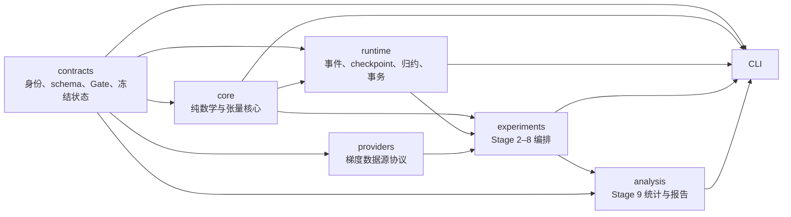

# 参数重要性实验基础设施

`param-importance-nlp` 是一套面向 NLP 训练过程的参数重要性研究基础设施。项目把数学定义、配置与身份、梯度估计器、路径积分、运行时恢复、实验编排、剪枝验证和统计报告拆成可审计的模块，并通过内容哈希把配置、代码、数据身份和派生产物连接起来。

当前版本为 **0.3.0**。仓库现阶段提供 Stage 0–9 的版本化契约、本机 CPU 核心、合成 fixture 和可扩展接口；它不包含模型或数据资产，也不把本机验证结果解释为正式训练结论。

## 当前状态与边界

截至 2026-07-22，Windows 本机适用验证结果为 **320 passed、6 skipped**，33 份仓库 schema 已通过统一入口重放，两次独立 fixture 运行产生了相同的配置、seed、registry、artifact 和报告哈希。完整证据见[本机验证报告](reports/local/local-validation-20260722.md)及其[机器可读版本](reports/local/local-validation-20260722.json)。

需要特别区分两类状态：

| 范围 | 状态集合 | 当前含义 |
|---|---|---|
| 正式 Gate | `PASS / CONDITIONALLY_ACCEPTED / FAIL / BLOCKED / STALE / NOT_RUN` | 服务器、真实资产、GPU/NCCL 和正式实验的资格判断 |
| 本机验证 | `PASS / FAIL / SKIPPED / NOT_RUN` | 仅说明 CPU 核心或 synthetic fixture 是否按合同工作 |

本机 fixture 始终声明 `scope=local_fixture`、`run_intent=local_fixture` 和 `formal_eligible=false`，不能写入 formal 结果区，也不能满足正式入口的 Gate。当前仍未完成或未冻结的内容包括：

- 服务器 HEAD、服务器端操作规范哈希和 formal Gate：`BLOCKED: server_unreachable`；
- CUDA/NCCL、真实模型与数据、真实训练和多卡性能：`NOT_RUN`；
- 正式 `B/M/R`、reference、求积默认规则、probe 数、节点预算和阈值：`UNFROZEN/BLOCKED`；
- Stage 4–9 的真实实验结论：尚未生成。

因此，“Stage 0–9”在本仓库中表示契约和核心代码覆盖范围，不表示这些阶段的正式实验已经完成。

## 研究对象

项目区分两个相关但不同的数学对象：

1. **固定参数状态下的局部梯度空间重要性**：比较 raw、独立 double sample、等权或加权 U-statistic 和一般 cross-U。未裁剪 U 核心量只在已声明的抽样假设下保留严格无偏性；由同批随机梯度得到的裁剪分数明确标记为 plug-in，不声称严格无偏。
2. **参数更新路径上的损失贡献**：在更新前后参数之间进行数值路径积分，输出逐参数 signed、positive、negative mass 和 absolute 贡献，并检查贡献总和与端点损失差之间的完备性残差。

统一符号、公式、统计假设、loss reduction 和数值边界见[数学规格说明](docs/mathematics.md)。总体研究路线见[实验总计划](plan/general_plan.md)。

## 分层架构

代码采用 `src` layout，并保持核心依赖尽量单向：



- `contracts` 不依赖训练、实验和分析实现，是所有分区共同使用的可信边界。
- `core` 放置可独立验证的数学与张量运算，不访问网络、服务器或模型供应商。
- `runtime` 处理状态变化、故障恢复和运行时语义，不决定科学实验矩阵。
- `providers` 只描述梯度如何取得；默认提供 synthetic 实现，外部框架采用延迟导入。
- `experiments` 消费已冻结合同，负责抽样、路径、训练路线、剪枝和消融编排。
- `analysis` 只从带哈希的冻结源表派生统计、图表和报告。

## 仓库结构

```text
.
├─ src/param_importance_nlp/   Python 包源码
│  ├─ contracts/              配置、身份、seed、provenance、Gate 与 artifact 合同
│  ├─ core/                   registry、loss、估计器、累计器、求积、剪枝与统计核心
│  ├─ runtime/                事件流、checkpoint、梯度生命周期、reducer 和 optimizer bridge
│  ├─ providers/              梯度数据源协议、synthetic provider 和可选依赖适配器
│  ├─ experiments/            Stage 2–8 的可复现实验编排
│  ├─ analysis/               Stage 9 指标、图表和 hash-bound 报告
│  ├─ cli.py                  统一命令行入口
│  └─ local_fixture.py        Stage 0–9 本机确定性小流水线
├─ schemas/                   shared 与 Stage 0–9 的 JSON Schema
├─ configs/local-fixtures/    不具备 formal 资格的本机冻结配置和合同集合
├─ docs/                      数学规格及 Stage 0 工程决策
├─ plan/                      总计划和 Stage 0–3 的详细执行计划
├─ environment/               平台依赖输入、精确锁、hash lock 和 wheel 清单
├─ ops/                       本机合同工具与 Stage 0 管理脚本
├─ policies/                  存储生命周期等机器可读策略
├─ tests/                     合同、数学、运行时、编排和分析测试
├─ reports/                   已提交的机器/人工可读验证证据
├─ worklogs/                  按时间记录的实施与验证日志
└─ legacy/2026-07-stage-ab/   冻结的历史实验归档，不属于当前 0.3.0 formal 证据链
```

运行产生的 `artifacts/`、模型、数据、checkpoint、wheel、cache 和原始结果均由 Git 忽略或守卫拒绝，不应提交到仓库。

## 代码模块作用

### 共享合同：`contracts/`

- `config.py`：严格合并与解析配置，拒绝未知、重复、废弃字段及非法跨字段组合；稳定计算 `config_hash`。
- `identity.py`：建立 experiment、run、attempt 和 session 身份，避免恢复或重试覆盖原 lineage。
- `seed.py`：从 master seed 派生相互隔离的命名 seed 域，防止不同实验环节意外共享随机流。
- `status.py`：分别定义 `GateRecord` 与 `LocalValidationRecord`，从类型层阻止本机 PASS 冒充 formal PASS。
- `freeze.py`、`readiness.py`：绑定 schema/source/config 哈希，并对 formal 入口实施 fail-closed 资格检查。
- `jsonio.py`、`artifacts.py`：规范化内部 canonical JSON；严格拒绝 BOM、重复键、非有限数和未知 artifact。legacy importer 只能先规范化再发布新 artifact。
- `provenance.py`：只接受白名单字段，避免将秘密、临时绝对路径或不可复现信息写入证据链。

### Stage 0 基础设施：根包模块

- `assets.py`：资产 manifest、角色化状态推进、完整性校验和 ready 解析，禁止把未验证文件直接交给运行时。
- `atomic.py`、`cache.py`：原子文件发布、稳定摘要和受控缓存操作。
- `storage.py`、`capacity.py`、`lifecycle.py`：数据根布局、存储预算、canary 和保留/回收策略。
- `environment.py`：依赖 lock、wheel manifest、平台标签和环境 provenance 的严格复核。
- `git_guard.py`：阻止模型、数据、checkpoint、wheel、超限文件和未经复核的二进制进入提交候选。

### 数学核心：`core/`

- `registry.py`：按 canonical name 登记唯一参数存储，审计 alias、shape、optimizer membership、参数组和稠密梯度资格；分别生成 `coordinate_registry_hash`、`optimizer_contract_hash` 和 `runtime_layout_hash`。
- `tensors.py`：提供带 registry 约束的 `TensorMap`，统一 shape、dtype、有限性和兼容性检查。
- `losses.py`：只依赖 Torch logits/labels，实现 causal-LM shift loss 与 sequence-classification loss。
- `sufficient_statistics.py`：流式维护等权和加权 U-statistic 所需充分统计量，并记录 statistical unit、weight unit 与 sampling design。
- `estimators.py`：实现 raw、double、U、weighted U、cross-U；将未缩放 `core` 与按参数组学习率及裁剪得到的 `score` 分开。
- `accumulator.py`：累计 signed、positive、negative mass、absolute、raw、data movement、net movement 和 endpoint movement，并维护 `signed = positive - negative_mass`、`absolute = positive + negative_mass`。
- `oracles.py`：FP64 解析 oracle、有限差分和可手算 fixture，用于验证公式而非充当训练实现。
- `quadrature.py`：left/right/midpoint/trapezoid/Simpson、复合规则及 Gauss–Legendre 路径积分核心。
- `pruning.py`、`baselines.py`、`metrics.py`：确定性坐标选择、magnitude/movement/Fisher/SI 基线及统计指标。

### 运行时：`runtime/`

- `events.py`：typed JSONL 事件、敏感字段扫描、单写者约束和 canonical optimizer-step 视图。
- `lineage.py`、`process_state.py`、`transactions.py`：attempt/session 推进、心跳、orphan/superseded 语义，以及 `parameter_post_state` 与 `attempt_commit_state` 的两段提交状态。
- `tensor_bundle.py`：安全张量 bundle。manifest 记录 dtype、shape、字节序、大小和 SHA-256，逐张量保存二进制内容，不反序列化任意 pickle 对象。
- `checkpoint.py`：先发布不可变 checkpoint 对象，再单独发布权威 commit；目录 rename 本身不代表可恢复，并支持发现、reconciliation、retention 与 tombstone。
- `gradients.py`：capture、unscale、finite check、global clip、install 和 skip 的显式梯度生命周期。
- `optimizer.py`：支持已验证的 SGD、Momentum 和非 fused AdamW 位移分解；未知、fused 或不受支持的行为显式拒绝。
- `reducers.py`：本机 `LocalReducer` 与 Torch distributed reducer；不会模拟 CUDA/NCCL 成功。

### 数据源与实验：`providers/`、`experiments/`

- `providers/protocols.py`：定义 `GradientProvider` 和只读 `FixedStateGradientProvider`。
- `providers/synthetic.py`：为本机 reference、paired estimator 和恢复测试提供确定性梯度数据。
- `providers/optional.py`：延迟导入 Transformers、Datasets、Accelerate、Safetensors 和 TensorBoard；缺失时抛出明确的 `DependencyUnavailable`。
- `experiments/sampling.py`：版本化 sampling universe、五个独立随机流、draw ID、nested M 和冻结候选网格。
- `experiments/stage2.py`：streaming reference、paired runner、不可变 sufficient-stat shard、确定性 reducer、恢复和 fixture-only estimator decision。
- `experiments/stage3.py`：endpoint/probe/path-state、无副作用上下文、节点缓存、reference 加密收敛和 quadrature decision。
- `experiments/routes.py`：通用训练 phase DAG、共享初始化和 pretrain/finetune lineage 约束；formal 在线 importance 必须读取合格的 Stage 2 decision。
- `experiments/pruning.py`：高/低/随机、全局/层平衡的剪枝研究矩阵。
- `experiments/ablation.py`：单因素消融矩阵、父子 lineage 和独立 seed 域。

### 分析：`analysis/`

- `metrics.py`：Bias、Variance、MSE、MAE、Pearson、Spearman、top-k、Gini、entropy、HHI、有效参数数、top-q mass、置信区间和损伤 AUC。
- `report.py`：从冻结源表构建可重放的 `AnalysisReport`；报告数字不允许脱离 source hash 手工修改。
- `charts.py`：使用 hash-bound `ChartSpec` 生成确定性图表 artifact。

对于零总质量、零范数、常量向量、`P=1` 或统计量不唯一等情况，分析 API 返回 `defined=false` 和原因，不使用 epsilon 伪造有效数字。

## Stage 覆盖关系

| 阶段 | 当前仓库提供的契约与核心 | 仍需正式环境完成的内容 |
|---|---|---|
| Stage 0 | 配置、身份、seed、事件、存储、checkpoint、恢复、reducer、CLI | 服务器环境、GPU/NCCL、真实资产与 formal Gate |
| Stage 1 | registry、loss、raw/double/U、累计器、梯度与 optimizer bridge、FP64 oracle | 真实模型上的单卡/多卡与训练边界确认 |
| Stage 2 | sampling、reference、paired runner、shard/reducer、selector、synthetic 状态机 | 真实 pilot、正式 `B/M/R`、reference 和 estimator decision |
| Stage 3 | path state、求积规则、节点缓存、完备性、reference 收敛 | 正式默认规则、probe/节点预算和阈值 |
| Stage 4–6 | 训练 phase DAG、共享初始化、checkpoint lineage、decision 强制 | 实际预训练、直接监督、微调和重要性轨迹 |
| Stage 7 | 可恢复的非破坏性剪枝、排序与基线接口 | 真实任务上的功能损伤曲线 |
| Stage 8 | 单因素消融矩阵和 lineage/seed 约束 | 冻结并执行正式消融矩阵 |
| Stage 9 | 指标、置信区间、图表规格和 hash-bound 报告 | 从正式冻结源表生成最终结论 |

## 本机环境

### 要求

- Windows；
- CPython `3.12.x`；
- 本机验证 profile 使用 Torch `2.10.0+cpu`；
- 不需要 CUDA、NCCL、Transformers、Datasets、Accelerate、Safetensors 或 TensorBoard。

`.venv/` 已由 Git 忽略。推荐使用带哈希的离线安装路径；仓库只保存 lock 和 wheel 清单，不保存 wheel 本体：

```powershell
py -3.12 -m venv .venv

# <wheelhouse> 中的文件应与 environment/windows-cpu-wheel-manifest.tsv 一致。
.\.venv\Scripts\python.exe -m pip install `
  --no-index --find-links <wheelhouse> --require-hashes `
  -r environment\windows-cpu-requirements-hashed.lock

# 依赖就绪后，以 editable 方式安装当前源码；不重新解析或下载依赖。
.\.venv\Scripts\python.exe -m pip install --no-build-isolation --no-deps -e .
```

依赖文件各自的职责、锁定规则和离线边界见[环境说明](environment/LOCKING.md)。Linux/server lock 是服务器候选环境的输入；在服务器不可连接期间，本机验证不会将其标为 formal PASS。

## 快速验证

```powershell
$PY = ".\.venv\Scripts\python.exe"

# 查看统一 CLI。
& $PY -m param_importance_nlp --help

# 重放一个 Stage 合同和一个 canonical fixture 配置。
& $PY -m param_importance_nlp contract-validate schemas\stage1\contract-v1.json
& $PY -m param_importance_nlp artifact-validate configs\local-fixtures\resolved-config-v1.json

# 运行不读取网络、模型或数据的确定性 CPU fixture。
& $PY -m param_importance_nlp local-fixture `
  --output-dir artifacts\local-fixture\readme-smoke

# 运行完整本机测试。
& $PY -m pytest -q
```

fixture 会在指定目录发布：

- `local-fixture-result.json`：Stage 1–3 数值结果、决策边界和跨阶段哈希；
- `analysis-report.json`：机器可读的 Stage 9 fixture 报告；
- `local-fixture-report.md`：由同一冻结输入生成的中文摘要。

输出目录必须位于配置的 `runtime.output_root` 下，不能通过 `..`、symlink/junction 越界，也不能使用 `formal`、`formal-`、`formal_` 或 `formal.` 开头的结果目录名。

## 统一 CLI

安装后可使用 `param-importance`；也可直接运行 `python -m param_importance_nlp`。`param-importance-stage0` 作为兼容入口保留，并指向同一 CLI。

| 子命令 | 作用 |
|---|---|
| `git-guard` | 检查超限文件、禁止类型/目录和需人工复核的二进制资产 |
| `storage-check` | 校验数据根布局、可写性和 canary |
| `storage-budget-check` | 在启动前验证存储预算 |
| `config-resolve` | 严格合并配置层并输出稳定摘要或 canonical 配置 |
| `config-diff` | 比较两个 resolved config 的语义差异 |
| `contract-validate` | 重放仓库 contract/schema 的严格外壳与 Python 合同 |
| `artifact-validate` | 校验 canonical artifact 或安全 tensor bundle |
| `gate-summary` | 分开汇总 formal Gate 与 local validation |
| `formal-readiness` | 检查 freeze、decision 和 Gate 证据链，不启动训练 |
| `local-fixture` | 执行本机确定性 CPU 数学流水线 |
| `report-build` | 从带 hash 的冻结源表重建 JSON/Markdown 报告 |

正式资格检查是 fail-closed 的。例如下面的本机配置缺少 formal freeze、decision 和 Gate，因此预期返回退出码 `3`；这表示“证据尚未具备”，不是 fixture 失败：

```powershell
& $PY -m param_importance_nlp formal-readiness `
  --config configs\local-fixtures\resolved-config-v1.json
$LASTEXITCODE  # 预期为 3
```

传入无效合同或 artifact 时返回退出码 `2`；一般执行失败返回非零值。每个子命令的最新参数以 `--help` 为准。

## 关键数据与恢复协议

### 参数身份

同一个参数集合维护三个独立哈希：

- `coordinate_registry_hash`：canonical name、alias、shape、顺序、eligibility、静态 group ID 和标签；
- `optimizer_contract_hash`：参数组映射、optimizer 类型和静态超参数；
- `runtime_layout_hash`：device、dtype 和运行时布局。

动态学习率属于 step 事件，不进入坐标哈希。共享同一 `Parameter` 只登记一次；不同对象重叠 storage、跨组重复和 sparse gradient 会被拒绝。

### dtype profile

- 在线梯度、充分统计量和长期累计：FP32；
- 计数：int64；
- oracle/reference：FP64；
- comparator：先转 FP64 再计算误差；
- quadrature 权重：FP64；路径累计 dtype 由配置冻结并写入 artifact。

未记录的隐式 dtype 转换不属于合同允许行为。

### Artifact 与 checkpoint

项目内部 JSON 必须是严格 UTF-8、无 BOM、无重复键、无 `NaN/Infinity` 的 canonical artifact。外部 legacy manifest 可以由独立 importer 读取 UTF-8 BOM，但必须先规范化并发布为新的 canonical artifact。

tensor/checkpoint 使用 JSON manifest 加逐张量二进制文件，每个文件绑定 dtype、shape、字节序、大小和 SHA-256。checkpoint 采用“不可变对象发布 + 独立权威 commit”的两阶段协议；发现器只信任完整、校验通过且 lineage 合法的 commit。

## 测试与可复核证据

测试覆盖以下主要边界：

- strict config、schema、hash、seed 隔离、路径逃逸和未知字段；
- registry 顺序、alias、storage 重叠、`grad=None`、sparse 与跨 dtype/device 身份；
- loss reduction、raw/double/U、加权边界、负 U、纯噪声、排列不变性和参数组学习率；
- 裁剪 plug-in 命名、累计恒等式、优化器位移和 finite/skip 生命周期；
- 事件 lineage、checkpoint 故障注入、损坏拒绝和 uninterrupted/resume 等价；
- Stage 2 随机流、draw 重放、nested M、成本语义、恢复和 selector；
- Stage 3 多项式解析积分、理论阶、完备性、抵消、缓存和状态恢复；
- 训练路线 lineage、formal decision 强制、剪枝恢复、并列决胜、消融和报告确定性。

当前 6 个 skip 都有明确平台原因：2 个 Windows symlink 权限、1 个 POSIX permission 语义、3 个当前 Windows Torch wheel 无可用 Gloo device 的 world-size 1/2/4 测试。它们不计作 GPU/NCCL 或 formal distributed PASS。

建议在提交前至少执行：

```powershell
& $PY -m compileall -q src ops
& $PY -m pytest -q
git diff --check
& $PY -m param_importance_nlp git-guard --repo .
```

实施详情和未运行项见[本机验证工作日志](worklogs/2026-07-22-stage0-9-local-validation.md)。

## 开发约束

- 新功能应放入既有 `param_importance_nlp` 分区，不建立平行命名空间。
- 核心数学函数优先保持纯函数或显式状态对象；模型供应商代码只能通过协议和延迟导入接入。
- 新增配置字段、artifact 或行为前，先更新合同、schema、失败规则和测试。
- 所有未知字段、未知状态、未知 optimizer 行为和不完整证据应 fail-closed。
- 机器字段名与错误码保持英文；核心模块说明、公共 API docstring 和数学注释使用清晰中文。
- 不向 Git 提交模型、数据、checkpoint、cache、wheel、大型数组、临时 fixture 或秘密。
- `ops/stage0/` 下的管理员脚本只用于经过授权的服务器维护；本机开发和测试不得执行它们。普通修改也不应无意义改写其哈希绑定内容。
- `ops/local_contracts.py` 只从仓库源码、schema、计划和本机 resolved config 确定性重建 fixture freeze；它不会生成 formal Gate。
- `legacy/2026-07-stage-ab/` 是带清单的历史只读归档。当前代码、schema 和 Gate 不应从其中反向读取或推导 formal 状态。

## 文档导航

- [数学规格](docs/mathematics.md)
- [总体实验计划](plan/general_plan.md)
- [Stage 0 详细计划](plan/stage0/README.md)
- [Stage 1 详细计划](plan/stage1/README.md)
- [Stage 2 详细计划](plan/stage2/README.md)
- [Stage 3 详细计划](plan/stage3/README.md)
- [环境与锁定规则](environment/LOCKING.md)
- [本机验证报告](reports/local/local-validation-20260722.md)
- [工作日志索引](worklogs/README.md)

本仓库当前未声明开源许可证。未经许可，不应假定可将代码或历史实验资产用于仓库范围之外的分发。
